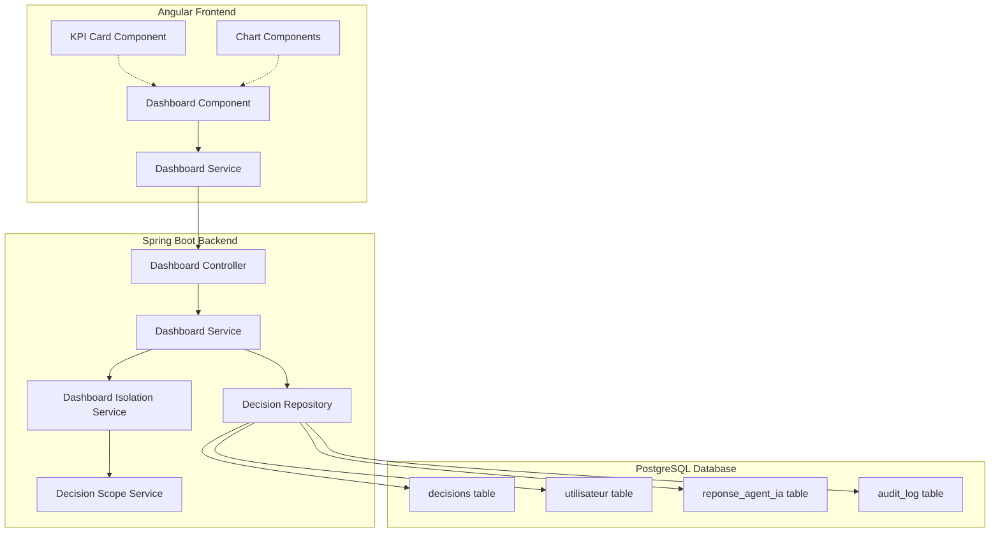
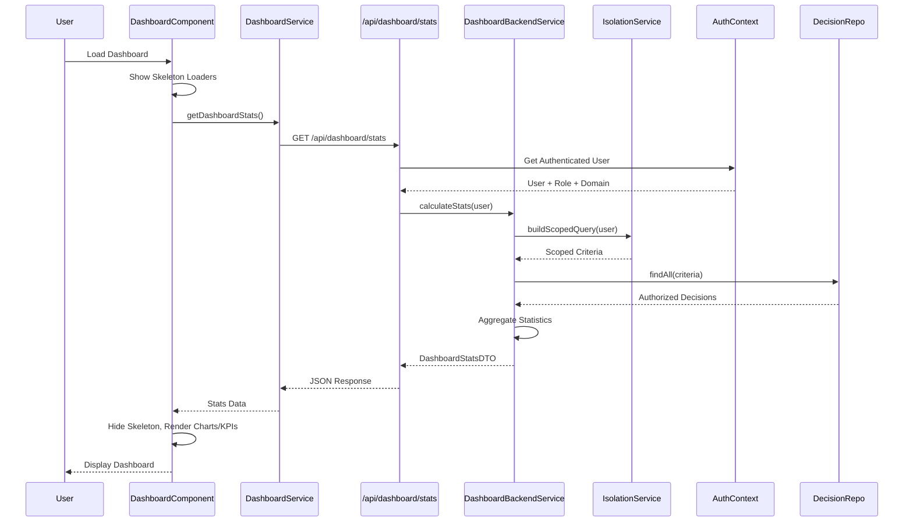

# Technical Design Document: Professional Role Dashboards

## Overview

This design document describes the implementation of 9 role-specific professional dashboards for an AI decision traceability system. Each dashboard provides tailored key performance indicators (KPIs), charts, and real-time data while enforcing strict data isolation based on user roles and decision domains (CREDIT, MEDICAL, EDUCATION).

### System Context

The system is a Spring Boot backend with Angular frontend using PrimeNG UI components. It manages AI decisions across three domains with a multi-role access control system:

- **Creator Roles**: ADMINISTRATEUR, AGENT_CREDIT, AGENT_SANTE, AGENT_PEDAGOGIQUE
- **Validator Roles**: VALIDATEUR, RESPONSABLE_CREDIT, PROFESSIONNEL_SANTE, RESPONSABLE_PEDAGOGIQUE
- **Read-Only Roles**: AUDITEUR

### Key Design Principles

1. **Security-First**: Data isolation enforced at backend layer using existing DecisionScopeService patterns
2. **Real Data Only**: No mock data, fake values, or Math.random() - all statistics from actual database queries
3. **Role-Based Views**: Each of the 9 roles gets a customized dashboard layout and data scope
4. **Performance**: Statistics queries must complete within 2 seconds for datasets up to 10,000 decisions
5. **Responsive Design**: Dashboards adapt to desktop, tablet, and mobile screens

## Architecture

### High-Level Architecture



### Data Flow



## Components and Interfaces

### Backend Components

#### 1. Dashboard Controller

**Purpose**: REST API endpoint exposing dashboard statistics

**File**: `backend/src/main/java/com/pfa/tracabilite_ia/controller/DashboardController.java`

```java
@RestController
@RequestMapping("/api/dashboard")
@RequiredArgsConstructor
public class DashboardController {
    
    private final DashboardService dashboardService;
    private final AuthService authService;
    
    @GetMapping("/stats")
    @PreAuthorize("isAuthenticated()")
    public ResponseEntity<DashboardStatsDTO> getDashboardStats() {
        Utilisateur currentUser = authService.getCurrentUser();
        DashboardStatsDTO stats = dashboardService.calculateDashboardStats(currentUser);
        return ResponseEntity.ok(stats);
    }
}
```

**Security**: Uses Spring Security `@PreAuthorize` annotation, retrieves authenticated user from security context

#### 2. Dashboard Service

**Purpose**: Orchestrates statistics calculation with role-based data isolation

**File**: `backend/src/main/java/com/pfa/tracabilite_ia/service/DashboardService.java`

```java
@Service
@RequiredArgsConstructor
public class DashboardService {
    
    private final DecisionRepository decisionRepository;
    private final UtilisateurRepository utilisateurRepository;
    private final AuditLogRepository auditLogRepository;
    private final DashboardIsolationService isolationService;
    
    public DashboardStatsDTO calculateDashboardStats(Utilisateur user) {
        // Build scoped query based on user role
        Specification<Decision> scope = isolationService.buildDashboardScope(user);
        
        // Fetch authorized decisions
        List<Decision> decisions = decisionRepository.findAll(scope);
        
        // Calculate role-specific statistics
        return buildDashboardDTO(decisions, user);
    }
    
    private DashboardStatsDTO buildDashboardDTO(List<Decision> decisions, Utilisateur user) {
        DashboardStatsDTO dto = new DashboardStatsDTO();
        dto.setKpiValues(calculateKPIs(decisions, user));
        dto.setTimelineData(calculateTimeline(decisions));
        dto.setStatusDistribution(calculateStatusDistribution(decisions));
        dto.setDomainDistribution(calculateDomainDistribution(decisions, user));
        dto.setTopCreators(calculateTopCreators(decisions, user));
        dto.setRecentDecisions(getRecentDecisions(decisions));
        dto.setRecentValidations(getRecentValidations(decisions, user));
        return dto;
    }
}
```

**Responsibilities**:
- Delegate scope-building to DashboardIsolationService
- Execute scoped queries
- Aggregate statistics from query results
- Build comprehensive DTO response

#### 3. Dashboard Isolation Service

**Purpose**: Enforces data isolation rules for dashboard statistics queries

**File**: `backend/src/main/java/com/pfa/tracabilite_ia/service/DashboardIsolationService.java`

```java
@Service
@RequiredArgsConstructor
public class DashboardIsolationService {
    
    private final UtilisateurRepository utilisateurRepository;
    
    public Specification<Decision> buildDashboardScope(Utilisateur user) {
        RoleEnum role = user.getRole();
        
        return switch (role) {
            case ADMINISTRATEUR, AUDITEUR -> allDomainsSpec();
            case AGENT_CREDIT -> agentScopeSpec(user, DecisionDomain.CREDIT);
            case AGENT_SANTE -> agentScopeSpec(user, DecisionDomain.MEDICAL);
            case AGENT_PEDAGOGIQUE -> agentScopeSpec(user, DecisionDomain.EDUCATION);
            case VALIDATEUR -> domainOnlySpec(DecisionDomain.CREDIT);
            case RESPONSABLE_CREDIT -> domainOnlySpec(DecisionDomain.CREDIT);
            case PROFESSIONNEL_SANTE -> domainOnlySpec(DecisionDomain.MEDICAL);
            case RESPONSABLE_PEDAGOGIQUE -> domainOnlySpec(DecisionDomain.EDUCATION);
            default -> throw new IllegalStateException("Unsupported role: " + role);
        };
    }
    
    private Specification<Decision> agentScopeSpec(Utilisateur user, DecisionDomain domain) {
        return (root, query, cb) -> {
            // Agent sees: own decisions + ADMINISTRATEUR decisions in same domain
            Predicate domainMatch = cb.equal(root.get("domaine"), domain);
            Predicate ownDecisions = cb.equal(root.get("createdBy"), user.getEmail());
            Predicate adminDecisions = root.get("createdBy").in(
                utilisateurRepository.findEmailsByRole(RoleEnum.ADMINISTRATEUR)
            );
            return cb.and(domainMatch, cb.or(ownDecisions, adminDecisions));
        };
    }
    
    private Specification<Decision> domainOnlySpec(DecisionDomain domain) {
        return (root, query, cb) -> cb.equal(root.get("domaine"), domain);
    }
    
    private Specification<Decision> allDomainsSpec() {
        return (root, query, cb) -> cb.conjunction(); // No filter
    }
}
```

**Key Isolation Rules**:
- **ADMINISTRATEUR/AUDITEUR**: All domains, all decisions
- **Agent Roles**: Own decisions + ADMINISTRATEUR decisions in agent's domain
- **VALIDATEUR**: CREDIT domain only
- **Manager Roles**: Domain-specific (CREDIT, MEDICAL, or EDUCATION)

#### 4. DTOs

**File**: `backend/src/main/java/com/pfa/tracabilite_ia/dto/DashboardStatsDTO.java`

```java
@Data
@Builder
@NoArgsConstructor
@AllArgsConstructor
public class DashboardStatsDTO {
    private KPIValues kpiValues;
    private List<TimelineDataPoint> timelineData;
    private StatusDistribution statusDistribution;
    private DomainDistribution domainDistribution;
    private List<CreatorStats> topCreators;
    private List<RecentDecisionDTO> recentDecisions;
    private List<ValidationActionDTO> recentValidations;
}

@Data
@Builder
public class KPIValues {
    private Long totalDecisions;
    private Long pendingValidations;
    private Long todaysDecisions;
    private Long activeUsers;
    private Long validatedDecisions;
    private Long rejectedDecisions;
    private Double acceptanceRate;
    private Double validationRate;
    private Long processedDecisions;
    private Double complianceRate;
}

@Data
@Builder
public class TimelineDataPoint {
    private LocalDate date;
    private Long decisionCount;
    private Long validationCount;
}

@Data
@Builder
public class StatusDistribution {
    private Long enAttenteValidation;
    private Long validee;
    private Long rejetee;
}

@Data
@Builder
public class DomainDistribution {
    private Long creditCount;
    private Long medicalCount;
    private Long educationCount;
}

@Data
@Builder
public class CreatorStats {
    private String creatorEmail;
    private String creatorName;
    private Long decisionCount;
}
```

**Validation**: All DTOs use Bean Validation annotations (@NotNull, @Min, etc.)

### Frontend Components

#### 1. Dashboard Component (Role-Specific)

The system provides 9 distinct dashboard components, one per role:

**Files**:
- `frontend/src/app/features/dashboard/admin-dashboard/admin-dashboard.component.ts`
- `frontend/src/app/features/dashboard/agent-credit-dashboard/agent-credit-dashboard.component.ts`
- `frontend/src/app/features/dashboard/agent-sante-dashboard/agent-sante-dashboard.component.ts`
- `frontend/src/app/features/dashboard/agent-pedagogique-dashboard/agent-pedagogique-dashboard.component.ts`
- `frontend/src/app/features/dashboard/validateur-dashboard/validateur-dashboard.component.ts`
- `frontend/src/app/features/dashboard/responsable-credit-dashboard/responsable-credit-dashboard.component.ts`
- `frontend/src/app/features/dashboard/professionnel-sante-dashboard/professionnel-sante-dashboard.component.ts`
- `frontend/src/app/features/dashboard/responsable-pedagogique-dashboard/responsable-pedagogique-dashboard.component.ts`
- `frontend/src/app/features/dashboard/auditeur-dashboard/auditeur-dashboard.component.ts`

**Common Structure** (TypeScript):

```typescript
@Component({
  selector: 'app-admin-dashboard',
  standalone: true,
  imports: [CommonModule, CardModule, SkeletonModule, TagModule, TableModule, ChartModule],
  templateUrl: './admin-dashboard.component.html',
  styleUrls: ['./admin-dashboard.component.scss']
})
export class AdminDashboardComponent implements OnInit {
  loading = signal(true);
  error = signal<string | null>(null);
  stats = signal<DashboardStatsDTO | null>(null);
  
  constructor(
    private dashboardService: DashboardService,
    private router: Router
  ) {}
  
  ngOnInit(): void {
    this.loadDashboardData();
  }
  
  loadDashboardData(): void {
    this.loading.set(true);
    this.error.set(null);
    
    this.dashboardService.getDashboardStats().subscribe({
      next: (data) => {
        this.stats.set(data);
        this.loading.set(false);
      },
      error: (err) => {
        this.error.set('Erreur lors du chargement des statistiques');
        this.loading.set(false);
        console.error('Dashboard error:', err);
      }
    });
  }
  
  retry(): void {
    this.loadDashboardData();
  }
  
  navigateToNewDecision(): void {
    // Navigate with domain pre-selection if agent role
    this.router.navigate(['/decisions/new']);
  }
}
```

**Common Template Structure** (HTML):

```html
<div class="dashboard-container">
  <header class="dashboard-header">
    <h1>Tableau de bord {{ roleLabel }}</h1>
    @if (canCreateDecision) {
      <button pButton label="Nouvelle Décision" icon="pi pi-plus" 
              (click)="navigateToNewDecision()"></button>
    }
  </header>
  
  @if (loading()) {
    <div class="skeleton-grid">
      <p-skeleton height="6rem" styleClass="mb-3" />
      <p-skeleton height="6rem" styleClass="mb-3" />
      <p-skeleton height="18rem" />
    </div>
  } @else if (error()) {
    <p-card>
      <p class="error-message">{{ error() }}</p>
      <button pButton label="Réessayer" (click)="retry()"></button>
    </p-card>
  } @else {
    <!-- KPI Cards Grid -->
    <div class="kpi-grid">
      <app-kpi-card *ngFor="let kpi of kpiCards()" 
                    [label]="kpi.label"
                    [value]="kpi.value"
                    [icon]="kpi.icon"
                    [trend]="kpi.trend">
      </app-kpi-card>
    </div>
    
    <!-- Charts Row -->
    <div class="charts-row">
      <app-donut-chart [data]="statusDistribution()" title="Répartition par statut">
      </app-donut-chart>
      
      <app-line-chart [data]="timelineData()" title="Évolution temporelle">
      </app-line-chart>
    </div>
    
    <!-- Recent Decisions Table -->
    <app-decisions-table [decisions]="recentDecisions()">
    </app-decisions-table>
  }
</div>
```

#### 2. Dashboard Service

**File**: `frontend/src/app/services/dashboard.service.ts`

```typescript
@Injectable({
  providedIn: 'root'
})
export class DashboardService {
  private apiUrl = '/api/dashboard';
  
  constructor(private http: HttpClient) {}
  
  getDashboardStats(): Observable<DashboardStatsDTO> {
    return this.http.get<DashboardStatsDTO>(`${this.apiUrl}/stats`).pipe(
      timeout(10000), // 10 second timeout
      catchError(this.handleError)
    );
  }
  
  private handleError(error: HttpErrorResponse): Observable<never> {
    let errorMessage = 'Une erreur est survenue';
    
    if (error.status === 0) {
      errorMessage = 'Impossible de contacter le serveur';
    } else if (error.status === 403) {
      errorMessage = 'Accès refusé';
    } else if (error.status === 500) {
      errorMessage = 'Erreur serveur';
    }
    
    return throwError(() => new Error(errorMessage));
  }
}
```

#### 3. KPI Card Component

**File**: `frontend/src/app/shared/components/kpi-card/kpi-card.component.ts`

```typescript
@Component({
  selector: 'app-kpi-card',
  standalone: true,
  imports: [CommonModule, CardModule, SkeletonModule],
  template: `
    <p-card styleClass="kpi-card">
      @if (loading) {
        <p-skeleton height="4rem"></p-skeleton>
      } @else {
        <div class="kpi-content">
          <i [class]="icon" class="kpi-icon"></i>
          <div class="kpi-body">
            <span class="kpi-label">{{ label }}</span>
            <strong class="kpi-value">{{ formattedValue }}</strong>
            @if (trend) {
              <span class="kpi-trend" [class.positive]="trend > 0" [class.negative]="trend < 0">
                <i [class]="trendIcon"></i> {{ Math.abs(trend) }}%
              </span>
            }
          </div>
        </div>
      }
    </p-card>
  `,
  styleUrls: ['./kpi-card.component.scss']
})
export class KpiCardComponent {
  @Input() label!: string;
  @Input() value!: number;
  @Input() icon: string = 'pi pi-chart-bar';
  @Input() trend?: number;
  @Input() loading: boolean = false;
  @Input() unit: string = '';
  
  get formattedValue(): string {
    if (this.unit === '%') {
      return `${this.value.toFixed(1)}%`;
    }
    return this.value.toLocaleString('fr-FR');
  }
  
  get trendIcon(): string {
    return this.trend && this.trend > 0 ? 'pi pi-arrow-up' : 'pi pi-arrow-down';
  }
  
  protected readonly Math = Math;
}
```

#### 4. Chart Components

**Donut Chart Component** - for status/domain distribution

**File**: `frontend/src/app/shared/components/donut-chart/donut-chart.component.ts`

```typescript
@Component({
  selector: 'app-donut-chart',
  standalone: true,
  imports: [CommonModule, CardModule, ChartModule],
  template: `
    <p-card [header]="title">
      @if (isEmpty) {
        <p class="empty-state">Aucune donnée disponible</p>
      } @else {
        <p-chart type="doughnut" [data]="chartData" [options]="chartOptions"></p-chart>
      }
    </p-card>
  `
})
export class DonutChartComponent implements OnChanges {
  @Input() title!: string;
  @Input() data!: { label: string; value: number; color: string }[];
  
  chartData: any;
  chartOptions: any;
  isEmpty = false;
  
  ngOnChanges(): void {
    this.isEmpty = !this.data || this.data.length === 0 || 
                   this.data.every(d => d.value === 0);
    
    if (!this.isEmpty) {
      this.chartData = {
        labels: this.data.map(d => d.label),
        datasets: [{
          data: this.data.map(d => d.value),
          backgroundColor: this.data.map(d => d.color)
        }]
      };
      
      this.chartOptions = {
        plugins: {
          legend: {
            position: 'bottom'
          },
          tooltip: {
            callbacks: {
              label: (context: any) => {
                const total = context.dataset.data.reduce((a: number, b: number) => a + b, 0);
                const percentage = ((context.parsed / total) * 100).toFixed(1);
                return `${context.label}: ${context.parsed} (${percentage}%)`;
              }
            }
          }
        }
      };
    }
  }
}
```

**Line Chart Component** - for timeline evolution

**File**: `frontend/src/app/shared/components/line-chart/line-chart.component.ts`

```typescript
@Component({
  selector: 'app-line-chart',
  standalone: true,
  imports: [CommonModule, CardModule, ChartModule],
  template: `
    <p-card [header]="title">
      @if (isEmpty) {
        <p class="empty-state">Aucune donnée disponible</p>
      } @else {
        <p-chart type="line" [data]="chartData" [options]="chartOptions"></p-chart>
      }
    </p-card>
  `
})
export class LineChartComponent implements OnChanges {
  @Input() title!: string;
  @Input() data!: { date: string; count: number }[];
  
  chartData: any;
  chartOptions: any;
  isEmpty = false;
  
  ngOnChanges(): void {
    this.isEmpty = !this.data || this.data.length === 0;
    
    if (!this.isEmpty) {
      this.chartData = {
        labels: this.data.map(d => this.formatDate(d.date)),
        datasets: [{
          label: 'Décisions',
          data: this.data.map(d => d.count),
          fill: false,
          borderColor: '#3b82f6',
          tension: 0.4
        }]
      };
      
      this.chartOptions = {
        plugins: {
          legend: {
            display: false
          }
        },
        scales: {
          y: {
            beginAtZero: true,
            ticks: {
              stepSize: 1
            }
          }
        }
      };
    }
  }
  
  private formatDate(dateStr: string): string {
    return new Date(dateStr).toLocaleDateString('fr-FR', { 
      month: 'short', 
      day: 'numeric' 
    });
  }
}
```

## Data Models

### Database Schema

The dashboard feature uses existing tables without schema modifications:

**decisions table** (existing):
- `decision_id` (UUID, PK)
- `domaine` (VARCHAR - CREDIT/MEDICAL/EDUCATION)
- `statut_validation` (VARCHAR - EN_ATTENTE_VALIDATION/VALIDEE/REJETEE)
- `created_by` (VARCHAR - user email)
- `created_at` (TIMESTAMP)
- Additional domain-specific fields

**utilisateur table** (existing):
- `id` (BIGINT, PK)
- `email` (VARCHAR)
- `nom` (VARCHAR)
- `prenom` (VARCHAR)
- `role` (VARCHAR - enum RoleEnum values)

**audit_log table** (existing):
- `id` (BIGINT, PK)
- `action` (VARCHAR)
- `entity_type` (VARCHAR)
- `entity_id` (VARCHAR)
- `user_email` (VARCHAR)
- `timestamp` (TIMESTAMP)

### Data Transfer Objects

See "Components and Interfaces > Backend Components > DTOs" section above for complete DTO definitions.


## Role-Specific Dashboard Specifications

### 1. ADMINISTRATEUR Dashboard

**Data Scope**: All domains (CREDIT, MEDICAL, EDUCATION), all decisions

**KPIs**:
- Total decisions across all domains
- Pending validations (EN_ATTENTE_VALIDATION)
- Decisions created today
- Active users count

**Charts**:
- Domain distribution (donut chart: CREDIT, MEDICAL, EDUCATION)
- Status distribution (donut chart: VALIDEE, REJETEE, EN_ATTENTE_VALIDATION)
- Timeline evolution (line chart: last 7 days)

**Tables**:
- Recent decisions (10 most recent)
- Recent validation actions (10 most recent)
- Top 5 creators by decision count

**Actions**: "Nouvelle Décision" button (no domain restriction)

### 2. AGENT_CREDIT Dashboard

**Data Scope**: CREDIT domain only, own decisions + ADMINISTRATEUR decisions

**KPIs**:
- My decisions count
- Pending validations (own decisions)
- Validated decisions (own decisions)
- Acceptance rate (validated / total)

**Charts**:
- Status distribution (own decisions)
- Timeline evolution (last 7 days, own decision creation)

**Tables**:
- Recent decisions (10 most recent from scope)
- Pending validations list (own EN_ATTENTE_VALIDATION decisions)

**Actions**: "Nouvelle Décision" button (CREDIT domain pre-selected)

### 3. AGENT_SANTE Dashboard

**Data Scope**: MEDICAL domain only, own decisions + ADMINISTRATEUR decisions

**KPIs**: Same as AGENT_CREDIT, scoped to MEDICAL domain

**Charts**: Same as AGENT_CREDIT, scoped to MEDICAL domain

**Tables**: Same as AGENT_CREDIT, scoped to MEDICAL domain

**Actions**: "Nouvelle Décision" button (MEDICAL domain pre-selected)

### 4. AGENT_PEDAGOGIQUE Dashboard

**Data Scope**: EDUCATION domain only, own decisions + ADMINISTRATEUR decisions

**KPIs**: Same as AGENT_CREDIT, scoped to EDUCATION domain

**Charts**: Same as AGENT_CREDIT, scoped to EDUCATION domain

**Tables**: Same as AGENT_CREDIT, scoped to EDUCATION domain

**Actions**: "Nouvelle Décision" button (EDUCATION domain pre-selected)


### 5. VALIDATEUR Dashboard

**Data Scope**: CREDIT domain only (legacy role)

**KPIs**:
- Pending validations (CREDIT, EN_ATTENTE_VALIDATION)
- Validated by me (CREDIT decisions validated by user)
- Rejected by me (CREDIT decisions rejected by user)
- Total processed (validated + rejected)

**Charts**:
- Status distribution (CREDIT domain)
- Timeline evolution (last 7 days, validation activity)

**Tables**:
- Pending validations (all CREDIT EN_ATTENTE_VALIDATION)
- Recent validation actions (10 most recent by user)

**Actions**: None (validator role, no creation)

### 6. RESPONSABLE_CREDIT Dashboard

**Data Scope**: CREDIT domain only

**KPIs**:
- Total decisions (CREDIT domain)
- Pending validations (CREDIT, EN_ATTENTE_VALIDATION)
- Validated this month (CREDIT domain, current month)
- Validation rate (validated / total in domain)

**Charts**:
- Status distribution (CREDIT domain)
- Timeline evolution (last 30 days, CREDIT domain activity)

**Tables**:
- Pending validations (CREDIT, EN_ATTENTE_VALIDATION)
- Top creators (CREDIT domain)

**Actions**: None (manager role, no creation)

### 7. PROFESSIONNEL_SANTE Dashboard

**Data Scope**: MEDICAL domain only

**KPIs**: Same as RESPONSABLE_CREDIT, scoped to MEDICAL domain

**Charts**: Same as RESPONSABLE_CREDIT, scoped to MEDICAL domain

**Tables**: Same as RESPONSABLE_CREDIT, scoped to MEDICAL domain

**Actions**: None (manager role, no creation)

### 8. RESPONSABLE_PEDAGOGIQUE Dashboard

**Data Scope**: EDUCATION domain only

**KPIs**: Same as RESPONSABLE_CREDIT, scoped to EDUCATION domain

**Charts**: Same as RESPONSABLE_CREDIT, scoped to EDUCATION domain

**Tables**: Same as RESPONSABLE_CREDIT, scoped to EDUCATION domain

**Actions**: None (manager role, no creation)

### 9. AUDITEUR Dashboard

**Data Scope**: All domains (CREDIT, MEDICAL, EDUCATION), all decisions, read-only

**KPIs**:
- Total decisions (all domains)
- Validated decisions (all domains, VALIDEE status)
- Rejected decisions (all domains, REJETEE status)
- Compliance rate (validated / total)

**Charts**:
- Domain distribution (donut chart: CREDIT, MEDICAL, EDUCATION)
- Status distribution (donut chart: all domains)
- Timeline evolution (line chart: last 30 days, all domains)

**Tables**:
- All decisions (read-only access)
- Audit trail entries (validation actions by validators)
- Validation activity by validator

**Actions**: None (auditor role, read-only, no creation)


## Error Handling

### Backend Error Handling

#### Authentication Errors

**Scenario**: User not authenticated or session expired

**Handling**:
```java
@ExceptionHandler(AuthenticationException.class)
public ResponseEntity<ErrorResponse> handleAuthenticationException(AuthenticationException ex) {
    return ResponseEntity.status(HttpStatus.UNAUTHORIZED)
        .body(new ErrorResponse("AUTHENTICATION_REQUIRED", "Authentification requise"));
}
```

**Frontend**: Redirect to login page

#### Authorization Errors

**Scenario**: User attempts to access dashboard without required role

**Handling**:
```java
@ExceptionHandler(AccessDeniedException.class)
public ResponseEntity<ErrorResponse> handleAccessDeniedException(AccessDeniedException ex) {
    log.warn("Access denied for user: {}", SecurityContextHolder.getContext().getAuthentication().getName());
    return ResponseEntity.status(HttpStatus.FORBIDDEN)
        .body(new ErrorResponse("ACCESS_DENIED", "Accès refusé"));
}
```

**Frontend**: Display error message with "Contact Administrator" guidance

#### Empty Data Sets

**Scenario**: User has no decisions in their scope

**Handling**:
- Backend returns empty collections (not null)
- Frontend displays role-appropriate empty state messages
- Agent roles: "Créez votre première décision"
- Validator roles: "Aucune décision en attente de validation"
- Manager roles: "Aucune décision dans votre domaine"

#### Database Query Timeout

**Scenario**: Statistics query exceeds 2-second threshold

**Handling**:
```java
@Transactional(timeout = 2)
public DashboardStatsDTO calculateDashboardStats(Utilisateur user) {
    try {
        // Query logic
    } catch (QueryTimeoutException ex) {
        log.error("Dashboard query timeout for user: {}", user.getEmail());
        throw new ServiceException("Le calcul des statistiques a pris trop de temps. Veuillez réessayer.");
    }
}
```

**Frontend**: Display error with retry button

#### Network Errors

**Scenario**: Frontend cannot reach backend API

**Handling**:
```typescript
private handleError(error: HttpErrorResponse): Observable<never> {
  if (error.status === 0) {
    // Network error
    return throwError(() => new Error('Impossible de contacter le serveur. Vérifiez votre connexion.'));
  }
  return throwError(() => new Error(error.message));
}
```

**Frontend**: Display network error with retry button

### Frontend Error States

#### Loading State

**Visual**: Skeleton loaders matching layout structure

**Implementation**:
```html
@if (loading()) {
  <div class="skeleton-grid">
    <p-skeleton height="6rem" styleClass="mb-3" />
    <p-skeleton height="6rem" styleClass="mb-3" />
    <p-skeleton height="18rem" />
  </div>
}
```

#### Error State

**Visual**: Error card with message and retry button

**Implementation**:
```html
@else if (error()) {
  <p-card styleClass="error-card">
    <i class="pi pi-exclamation-triangle error-icon"></i>
    <p class="error-message">{{ error() }}</p>
    <button pButton label="Réessayer" icon="pi pi-refresh" (click)="retry()"></button>
  </p-card>
}
```

#### Empty State

**Visual**: Icon with contextual message

**Implementation**:
```html
@if (recentDecisions().length === 0) {
  <div class="empty-state">
    <i class="pi pi-inbox empty-icon"></i>
    <p class="empty-message">{{ emptyMessage }}</p>
    @if (canCreateDecision) {
      <button pButton label="Créer une décision" (click)="navigateToNewDecision()"></button>
    }
  </div>
}
```


## Testing Strategy

### Property-Based Testing Assessment

**Decision**: Property-based testing is **NOT applicable** to this feature.

**Rationale**:
- This feature primarily involves **UI rendering**, **database aggregation queries**, and **REST API endpoints**
- The core logic is **data filtering and aggregation**, not pure functions with universal properties
- Testing requires verifying **specific role-based scoping rules** with concrete test scenarios
- **UI components** are better tested with component tests and snapshot tests
- **Database queries** are better tested with integration tests using real or embedded databases
- **Data isolation logic** is better tested with example-based unit tests covering each role

**Alternative Testing Approach**: Integration tests + example-based unit tests (see below)

### Backend Testing

#### 1. Dashboard Isolation Tests

**Purpose**: Verify data isolation rules for each role

**File**: `backend/src/test/java/com/pfa/tracabilite_ia/service/DashboardIsolationTest.java`

**Test Cases**:

```java
@SpringBootTest
@Transactional
class DashboardIsolationTest {
    
    @Autowired
    private DashboardService dashboardService;
    
    @Autowired
    private DecisionRepository decisionRepository;
    
    @Autowired
    private UtilisateurRepository utilisateurRepository;
    
    @Test
    void testAdministrateurSeesAllDomains() {
        // Setup: Create decisions in all domains
        createDecision("admin@test.com", DecisionDomain.CREDIT);
        createDecision("agent1@test.com", DecisionDomain.MEDICAL);
        createDecision("agent2@test.com", DecisionDomain.EDUCATION);
        
        // Execute: Get stats as ADMINISTRATEUR
        Utilisateur admin = createUser("admin@test.com", RoleEnum.ADMINISTRATEUR);
        DashboardStatsDTO stats = dashboardService.calculateDashboardStats(admin);
        
        // Assert: Admin sees all 3 decisions
        assertEquals(3L, stats.getKpiValues().getTotalDecisions());
        assertEquals(1L, stats.getDomainDistribution().getCreditCount());
        assertEquals(1L, stats.getDomainDistribution().getMedicalCount());
        assertEquals(1L, stats.getDomainDistribution().getEducationCount());
    }
    
    @Test
    void testAgentCreditSeesOnlyOwnAndAdminCreditDecisions() {
        // Setup: Create decisions in various domains and creators
        Decision ownCredit = createDecision("agent-credit@test.com", DecisionDomain.CREDIT);
        Decision adminCredit = createDecision("admin@test.com", DecisionDomain.CREDIT);
        Decision otherAgentCredit = createDecision("other-agent@test.com", DecisionDomain.CREDIT);
        Decision ownMedical = createDecision("agent-credit@test.com", DecisionDomain.MEDICAL);
        
        // Execute: Get stats as AGENT_CREDIT
        Utilisateur agentCredit = createUser("agent-credit@test.com", RoleEnum.AGENT_CREDIT);
        DashboardStatsDTO stats = dashboardService.calculateDashboardStats(agentCredit);
        
        // Assert: Agent sees only own + admin CREDIT decisions (2 total)
        assertEquals(2L, stats.getKpiValues().getTotalDecisions());
        List<UUID> visibleIds = stats.getRecentDecisions().stream()
            .map(RecentDecisionDTO::getDecisionId)
            .collect(Collectors.toList());
        assertTrue(visibleIds.contains(ownCredit.getDecisionId()));
        assertTrue(visibleIds.contains(adminCredit.getDecisionId()));
        assertFalse(visibleIds.contains(otherAgentCredit.getDecisionId()));
        assertFalse(visibleIds.contains(ownMedical.getDecisionId()));
    }
    
    @Test
    void testValidateurSeesOnlyCreditDomain() {
        // Setup: Create decisions in all domains
        createDecision("agent1@test.com", DecisionDomain.CREDIT);
        createDecision("agent1@test.com", DecisionDomain.CREDIT);
        createDecision("agent2@test.com", DecisionDomain.MEDICAL);
        createDecision("agent3@test.com", DecisionDomain.EDUCATION);
        
        // Execute: Get stats as VALIDATEUR
        Utilisateur validateur = createUser("validateur@test.com", RoleEnum.VALIDATEUR);
        DashboardStatsDTO stats = dashboardService.calculateDashboardStats(validateur);
        
        // Assert: Validateur sees only CREDIT decisions (2 total)
        assertEquals(2L, stats.getKpiValues().getTotalDecisions());
        assertEquals(2L, stats.getDomainDistribution().getCreditCount());
        assertEquals(0L, stats.getDomainDistribution().getMedicalCount());
        assertEquals(0L, stats.getDomainDistribution().getEducationCount());
    }
    
    @Test
    void testResponsableCreditSeesOnlyCreditDomain() {
        // Similar test for RESPONSABLE_CREDIT role
    }
    
    @Test
    void testProfessionnelSanteSeesOnlyMedicalDomain() {
        // Similar test for PROFESSIONNEL_SANTE role
    }
    
    @Test
    void testResponsablePedagogiqueSeesOnlyEducationDomain() {
        // Similar test for RESPONSABLE_PEDAGOGIQUE role
    }
    
    @Test
    void testAuditeurSeesAllDomainsReadOnly() {
        // Similar test for AUDITEUR role with all domains visible
    }
}
```

#### 2. Statistics Calculation Tests

**Purpose**: Verify accuracy of KPI calculations

**File**: `backend/src/test/java/com/pfa/tracabilite_ia/service/DashboardServiceTest.java`

**Test Cases**:

```java
@SpringBootTest
@Transactional
class DashboardServiceTest {
    
    @Test
    void testCalculateAcceptanceRate() {
        // Setup: Create 10 decisions - 7 VALIDEE, 2 REJETEE, 1 EN_ATTENTE
        Utilisateur agent = createUser("agent@test.com", RoleEnum.AGENT_CREDIT);
        for (int i = 0; i < 7; i++) {
            createDecision(agent.getEmail(), DecisionDomain.CREDIT, StatutValidation.VALIDEE);
        }
        for (int i = 0; i < 2; i++) {
            createDecision(agent.getEmail(), DecisionDomain.CREDIT, StatutValidation.REJETEE);
        }
        createDecision(agent.getEmail(), DecisionDomain.CREDIT, StatutValidation.EN_ATTENTE_VALIDATION);
        
        // Execute
        DashboardStatsDTO stats = dashboardService.calculateDashboardStats(agent);
        
        // Assert: Acceptance rate = 7 / 10 = 0.70 (70%)
        assertEquals(0.70, stats.getKpiValues().getAcceptanceRate(), 0.01);
    }
    
    @Test
    void testTimelineDataLast7Days() {
        // Setup: Create decisions across 7 days
        LocalDateTime now = LocalDateTime.now();
        for (int i = 0; i < 7; i++) {
            LocalDateTime timestamp = now.minusDays(i);
            createDecisionWithTimestamp("agent@test.com", DecisionDomain.CREDIT, timestamp);
        }
        
        // Execute
        Utilisateur agent = createUser("agent@test.com", RoleEnum.AGENT_CREDIT);
        DashboardStatsDTO stats = dashboardService.calculateDashboardStats(agent);
        
        // Assert: Timeline contains 7 data points
        assertEquals(7, stats.getTimelineData().size());
        assertTrue(stats.getTimelineData().stream()
            .allMatch(dp -> dp.getDecisionCount() == 1L));
    }
    
    @Test
    void testStatusDistributionCalculation() {
        // Setup: 5 EN_ATTENTE, 3 VALIDEE, 2 REJETEE
        Utilisateur user = createUser("user@test.com", RoleEnum.AGENT_CREDIT);
        createDecisions(user, StatutValidation.EN_ATTENTE_VALIDATION, 5);
        createDecisions(user, StatutValidation.VALIDEE, 3);
        createDecisions(user, StatutValidation.REJETEE, 2);
        
        // Execute
        DashboardStatsDTO stats = dashboardService.calculateDashboardStats(user);
        
        // Assert
        assertEquals(5L, stats.getStatusDistribution().getEnAttenteValidation());
        assertEquals(3L, stats.getStatusDistribution().getValidee());
        assertEquals(2L, stats.getStatusDistribution().getRejetee());
    }
}
```

#### 3. Performance Tests

**Purpose**: Verify queries complete within 2-second threshold

**File**: `backend/src/test/java/com/pfa/tracabilite_ia/service/DashboardPerformanceTest.java`

```java
@SpringBootTest
@Transactional
class DashboardPerformanceTest {
    
    @Test
    void testStatsCalculationUnder2SecondsFor10000Decisions() {
        // Setup: Create 10,000 decisions
        bulkCreateDecisions(10000);
        
        Utilisateur admin = createUser("admin@test.com", RoleEnum.ADMINISTRATEUR);
        
        // Execute with timing
        long startTime = System.currentTimeMillis();
        DashboardStatsDTO stats = dashboardService.calculateDashboardStats(admin);
        long duration = System.currentTimeMillis() - startTime;
        
        // Assert: Completes within 2000ms
        assertTrue(duration < 2000, 
            "Query took " + duration + "ms, expected < 2000ms");
    }
}
```


### Frontend Testing

#### 1. Component Unit Tests

**Purpose**: Test component logic in isolation

**File**: `frontend/src/app/features/dashboard/admin-dashboard/admin-dashboard.component.spec.ts`

**Test Cases**:

```typescript
describe('AdminDashboardComponent', () => {
  let component: AdminDashboardComponent;
  let fixture: ComponentFixture<AdminDashboardComponent>;
  let dashboardService: jasmine.SpyObj<DashboardService>;
  
  beforeEach(() => {
    const dashboardServiceSpy = jasmine.createSpyObj('DashboardService', ['getDashboardStats']);
    
    TestBed.configureTestingModule({
      imports: [AdminDashboardComponent],
      providers: [
        { provide: DashboardService, useValue: dashboardServiceSpy }
      ]
    });
    
    fixture = TestBed.createComponent(AdminDashboardComponent);
    component = fixture.componentInstance;
    dashboardService = TestBed.inject(DashboardService) as jasmine.SpyObj<DashboardService>;
  });
  
  it('should display skeleton loaders during initial load', () => {
    // Assert: loading signal is true initially
    expect(component.loading()).toBe(true);
    
    // Assert: skeleton elements are present
    const skeletons = fixture.nativeElement.querySelectorAll('p-skeleton');
    expect(skeletons.length).toBeGreaterThan(0);
  });
  
  it('should load dashboard data on init', () => {
    const mockStats: DashboardStatsDTO = {
      kpiValues: { totalDecisions: 100, pendingValidations: 10 },
      // ... other fields
    };
    dashboardService.getDashboardStats.and.returnValue(of(mockStats));
    
    // Execute
    component.ngOnInit();
    
    // Assert
    expect(dashboardService.getDashboardStats).toHaveBeenCalled();
    expect(component.stats()).toEqual(mockStats);
    expect(component.loading()).toBe(false);
  });
  
  it('should display error message when data fetch fails', () => {
    const errorMessage = 'Network error';
    dashboardService.getDashboardStats.and.returnValue(
      throwError(() => new Error(errorMessage))
    );
    
    // Execute
    component.ngOnInit();
    
    // Assert
    expect(component.error()).toBeTruthy();
    expect(component.loading()).toBe(false);
    
    // Assert: error card is displayed
    fixture.detectChanges();
    const errorCard = fixture.nativeElement.querySelector('.error-card');
    expect(errorCard).toBeTruthy();
  });
  
  it('should retry data fetch when retry button clicked', () => {
    // Setup: Initial error state
    dashboardService.getDashboardStats.and.returnValue(
      throwError(() => new Error('Error'))
    );
    component.ngOnInit();
    
    // Setup: Successful retry
    const mockStats: DashboardStatsDTO = { /* ... */ };
    dashboardService.getDashboardStats.and.returnValue(of(mockStats));
    
    // Execute
    component.retry();
    
    // Assert
    expect(dashboardService.getDashboardStats).toHaveBeenCalledTimes(2);
    expect(component.stats()).toEqual(mockStats);
    expect(component.error()).toBeNull();
  });
  
  it('should display empty state when no decisions exist', () => {
    const emptyStats: DashboardStatsDTO = {
      kpiValues: { totalDecisions: 0 },
      recentDecisions: [],
      // ...
    };
    dashboardService.getDashboardStats.and.returnValue(of(emptyStats));
    
    // Execute
    component.ngOnInit();
    fixture.detectChanges();
    
    // Assert: empty state is displayed
    const emptyState = fixture.nativeElement.querySelector('.empty-state');
    expect(emptyState).toBeTruthy();
  });
});
```

#### 2. KPI Card Component Tests

**File**: `frontend/src/app/shared/components/kpi-card/kpi-card.component.spec.ts`

```typescript
describe('KpiCardComponent', () => {
  let component: KpiCardComponent;
  let fixture: ComponentFixture<KpiCardComponent>;
  
  beforeEach(() => {
    TestBed.configureTestingModule({
      imports: [KpiCardComponent]
    });
    fixture = TestBed.createComponent(KpiCardComponent);
    component = fixture.componentInstance;
  });
  
  it('should format numeric values with thousand separators', () => {
    component.value = 12345;
    component.unit = '';
    
    expect(component.formattedValue).toBe('12 345');
  });
  
  it('should format percentage values with % symbol', () => {
    component.value = 75.5;
    component.unit = '%';
    
    expect(component.formattedValue).toBe('75.5%');
  });
  
  it('should display positive trend icon for positive trend', () => {
    component.trend = 15;
    
    expect(component.trendIcon).toBe('pi pi-arrow-up');
  });
  
  it('should display negative trend icon for negative trend', () => {
    component.trend = -10;
    
    expect(component.trendIcon).toBe('pi pi-arrow-down');
  });
  
  it('should display skeleton when loading', () => {
    component.loading = true;
    fixture.detectChanges();
    
    const skeleton = fixture.nativeElement.querySelector('p-skeleton');
    expect(skeleton).toBeTruthy();
  });
});
```

#### 3. Chart Component Tests

**File**: `frontend/src/app/shared/components/donut-chart/donut-chart.component.spec.ts`

```typescript
describe('DonutChartComponent', () => {
  let component: DonutChartComponent;
  let fixture: ComponentFixture<DonutChartComponent>;
  
  beforeEach(() => {
    TestBed.configureTestingModule({
      imports: [DonutChartComponent]
    });
    fixture = TestBed.createComponent(DonutChartComponent);
    component = fixture.componentInstance;
  });
  
  it('should display empty state when no data provided', () => {
    component.data = [];
    component.ngOnChanges();
    fixture.detectChanges();
    
    expect(component.isEmpty).toBe(true);
    const emptyState = fixture.nativeElement.querySelector('.empty-state');
    expect(emptyState).toBeTruthy();
  });
  
  it('should render chart when data provided', () => {
    component.data = [
      { label: 'Validée', value: 50, color: '#22c55e' },
      { label: 'Rejetée', value: 30, color: '#ef4444' },
      { label: 'En attente', value: 20, color: '#f59e0b' }
    ];
    component.ngOnChanges();
    fixture.detectChanges();
    
    expect(component.isEmpty).toBe(false);
    expect(component.chartData.labels).toEqual(['Validée', 'Rejetée', 'En attente']);
    expect(component.chartData.datasets[0].data).toEqual([50, 30, 20]);
  });
  
  it('should calculate percentages in tooltip', () => {
    component.data = [
      { label: 'A', value: 25, color: '#000' },
      { label: 'B', value: 75, color: '#fff' }
    ];
    component.ngOnChanges();
    
    // Simulate tooltip callback
    const context = {
      parsed: 25,
      label: 'A',
      dataset: { data: [25, 75] }
    };
    const label = component.chartOptions.plugins.tooltip.callbacks.label(context);
    
    expect(label).toContain('25.0%');
  });
});
```

#### 4. Integration Tests

**Purpose**: Test component with real service (using HttpClientTestingModule)

**File**: `frontend/src/app/features/dashboard/admin-dashboard/admin-dashboard.integration.spec.ts`

```typescript
describe('AdminDashboardComponent Integration', () => {
  let component: AdminDashboardComponent;
  let fixture: ComponentFixture<AdminDashboardComponent>;
  let httpMock: HttpTestingController;
  
  beforeEach(() => {
    TestBed.configureTestingModule({
      imports: [
        AdminDashboardComponent,
        HttpClientTestingModule
      ],
      providers: [DashboardService]
    });
    
    fixture = TestBed.createComponent(AdminDashboardComponent);
    component = fixture.componentInstance;
    httpMock = TestBed.inject(HttpTestingController);
  });
  
  afterEach(() => {
    httpMock.verify();
  });
  
  it('should make HTTP request and display data', () => {
    const mockStats: DashboardStatsDTO = {
      kpiValues: {
        totalDecisions: 250,
        pendingValidations: 15,
        todaysDecisions: 5,
        activeUsers: 12
      },
      timelineData: [],
      statusDistribution: { enAttenteValidation: 15, validee: 200, rejetee: 35 },
      domainDistribution: { creditCount: 100, medicalCount: 80, educationCount: 70 },
      topCreators: [],
      recentDecisions: [],
      recentValidations: []
    };
    
    // Trigger ngOnInit
    component.ngOnInit();
    
    // Expect HTTP request
    const req = httpMock.expectOne('/api/dashboard/stats');
    expect(req.request.method).toBe('GET');
    
    // Respond with mock data
    req.flush(mockStats);
    
    // Assert: Component updated
    expect(component.stats()).toEqual(mockStats);
    expect(component.loading()).toBe(false);
    
    // Assert: UI rendered
    fixture.detectChanges();
    const kpiCards = fixture.nativeElement.querySelectorAll('.kpi-card');
    expect(kpiCards.length).toBeGreaterThan(0);
  });
  
  it('should handle HTTP error', () => {
    component.ngOnInit();
    
    const req = httpMock.expectOne('/api/dashboard/stats');
    req.error(new ProgressEvent('Network error'), { status: 0 });
    
    expect(component.error()).toBeTruthy();
    expect(component.loading()).toBe(false);
  });
});
```


### Test Coverage Goals

**Backend**:
- **Unit Tests**: 80% coverage for service layer
- **Integration Tests**: 100% coverage for all 9 role isolation scenarios
- **Performance Tests**: Validate 2-second threshold for 10,000 decisions

**Frontend**:
- **Component Tests**: 80% coverage for all dashboard components
- **Integration Tests**: 90% coverage for HTTP interactions
- **E2E Tests** (optional): Smoke tests for each role dashboard

### Manual Testing Checklist

#### Role-Specific Manual Tests

For each of the 9 roles, manually verify:

1. ☐ Dashboard loads without errors
2. ☐ All KPI cards display correct values
3. ☐ Charts render with appropriate data
4. ☐ Recent decisions table shows only authorized decisions
5. ☐ Empty states display when no data exists
6. ☐ "Nouvelle Décision" button appears/disappears based on role
7. ☐ Domain pre-selection works for agent roles
8. ☐ Dark mode renders correctly
9. ☐ Responsive layout adapts to mobile/tablet/desktop
10. ☐ Skeleton loaders appear during initial load

#### Data Isolation Manual Tests

1. ☐ AGENT_CREDIT cannot see MEDICAL or EDUCATION decisions
2. ☐ AGENT_CREDIT can see own + ADMINISTRATEUR CREDIT decisions
3. ☐ AGENT_SANTE cannot see CREDIT or EDUCATION decisions
4. ☐ AGENT_PEDAGOGIQUE cannot see CREDIT or MEDICAL decisions
5. ☐ VALIDATEUR sees only CREDIT domain
6. ☐ RESPONSABLE_CREDIT sees only CREDIT domain
7. ☐ PROFESSIONNEL_SANTE sees only MEDICAL domain
8. ☐ RESPONSABLE_PEDAGOGIQUE sees only EDUCATION domain
9. ☐ ADMINISTRATEUR sees all domains
10. ☐ AUDITEUR sees all domains (read-only)

## Implementation Plan

### Phase 1: Backend Implementation

**Duration**: 3-4 days

**Tasks**:

1. **DTOs Creation** (0.5 day)
   - Create `DashboardStatsDTO` and nested DTOs
   - Add validation annotations
   - Write DTO unit tests

2. **Dashboard Isolation Service** (1 day)
   - Implement `buildDashboardScope()` method
   - Create specifications for each role
   - Write isolation unit tests for all 9 roles

3. **Dashboard Service** (1 day)
   - Implement `calculateDashboardStats()` method
   - Implement KPI calculation methods
   - Implement timeline, distribution, and creator aggregation methods
   - Write service unit tests

4. **Dashboard Controller** (0.5 day)
   - Implement `/api/dashboard/stats` endpoint
   - Add security annotations
   - Write controller integration tests

5. **Performance Optimization** (1 day)
   - Add database indexes if needed
   - Optimize queries with projections
   - Run performance tests with 10,000 decisions
   - Verify 2-second threshold

### Phase 2: Frontend Implementation

**Duration**: 4-5 days

**Tasks**:

1. **Dashboard Service** (0.5 day)
   - Create `DashboardService` with `getDashboardStats()` method
   - Implement error handling
   - Write service unit tests

2. **Shared Components** (1.5 days)
   - Create `KpiCardComponent`
   - Create `DonutChartComponent`
   - Create `LineChartComponent`
   - Create `DecisionsTableComponent`
   - Write component unit tests

3. **Role-Specific Dashboards** (2 days)
   - Create 9 dashboard components (one per role)
   - Implement loading/error/empty states
   - Configure KPI cards and charts per role
   - Wire up navigation and actions

4. **Routing Configuration** (0.5 day)
   - Add route guards checking user role
   - Route to appropriate dashboard based on authenticated user's role
   - Test routing for all roles

5. **Responsive Design & Dark Mode** (0.5 day)
   - Add responsive CSS (desktop/tablet/mobile)
   - Verify dark mode compatibility
   - Test on multiple screen sizes

6. **Frontend Testing** (1 day)
   - Write component unit tests
   - Write integration tests
   - Manual testing checklist execution

### Phase 3: Integration Testing

**Duration**: 1-2 days

**Tasks**:

1. **End-to-End Data Isolation Tests** (1 day)
   - Create test users for all 9 roles
   - Create test decisions across all domains
   - Execute isolation checklist for each role
   - Document test results

2. **Performance Testing** (0.5 day)
   - Create dataset with 10,000 decisions
   - Measure query execution time for each role
   - Verify 2-second threshold compliance

3. **Bug Fixes & Refinement** (0.5 day)
   - Fix issues found during testing
   - Verify fixes don't break isolation rules
   - Re-run critical tests

### Phase 4: Documentation & Deployment

**Duration**: 1 day

**Tasks**:

1. **API Documentation** (0.5 day)
   - Document `/api/dashboard/stats` endpoint in Swagger/OpenAPI
   - Add request/response examples
   - Document error codes

2. **User Documentation** (0.5 day)
   - Create user guide for each role's dashboard
   - Document KPI meanings
   - Add screenshots

3. **Deployment** (as needed)
   - Deploy backend changes
   - Deploy frontend changes
   - Run smoke tests in production

**Total Estimated Duration**: 9-12 days

## Security Considerations

### 1. Data Isolation at Backend

**Principle**: Never trust frontend parameters for authorization

**Implementation**:
- User role and domain determined exclusively from Spring Security context
- No role or domain parameters accepted from HTTP requests
- All queries filtered through `DashboardIsolationService`

**Code Example**:
```java
// ❌ WRONG: Don't accept role from request
@GetMapping("/stats")
public DashboardStatsDTO getStats(@RequestParam String role) {
    // Never do this - role can be spoofed
}

// ✅ CORRECT: Get user from security context
@GetMapping("/stats")
public DashboardStatsDTO getStats() {
    Utilisateur user = authService.getCurrentUser();
    // User and role are authenticated and trusted
}
```

### 2. SQL Injection Prevention

**Implementation**:
- Use Spring Data JPA Specifications
- Use parameterized queries (no string concatenation)
- Validate all inputs

**Code Example**:
```java
// ✅ CORRECT: Parameterized query via Specification
Specification<Decision> spec = (root, query, cb) -> 
    cb.equal(root.get("domaine"), domain);
```

### 3. Audit Logging

**Implementation**:
- Log all dashboard access attempts
- Log unauthorized access attempts
- Include user, role, timestamp, and IP address

**Code Example**:
```java
@Aspect
@Component
public class DashboardAuditAspect {
    
    @Around("execution(* com.pfa.tracabilite_ia.controller.DashboardController.getDashboardStats(..))")
    public Object auditDashboardAccess(ProceedingJoinPoint joinPoint) throws Throwable {
        Utilisateur user = authService.getCurrentUser();
        auditLogService.logAccess("DASHBOARD_STATS", user.getEmail(), user.getRole());
        
        try {
            return joinPoint.proceed();
        } catch (AccessDeniedException ex) {
            auditLogService.logUnauthorizedAccess("DASHBOARD_STATS", user.getEmail(), user.getRole());
            throw ex;
        }
    }
}
```

### 4. Rate Limiting

**Implementation**:
- Apply rate limiting to dashboard endpoint
- Prevent abuse and DoS attacks
- 10 requests per minute per user

**Configuration**:
```java
@Configuration
public class RateLimitConfig {
    
    @Bean
    public RateLimiter dashboardRateLimiter() {
        return RateLimiter.create(10.0 / 60.0); // 10 per minute
    }
}
```

## Performance Optimization

### 1. Database Indexes

**Required Indexes**:

```sql
-- Index for domain filtering
CREATE INDEX idx_decision_domain ON decisions(domaine);

-- Index for status filtering
CREATE INDEX idx_decision_status ON decisions(statut_validation);

-- Index for creator filtering
CREATE INDEX idx_decision_creator ON decisions(created_by);

-- Index for date range queries
CREATE INDEX idx_decision_created_at ON decisions(created_at);

-- Composite index for agent queries
CREATE INDEX idx_decision_domain_creator ON decisions(domaine, created_by);

-- Composite index for timeline queries
CREATE INDEX idx_decision_created_at_domain ON decisions(created_at, domaine);
```

### 2. Query Optimization

**Use Projections**:

Instead of fetching full entities, use projections for statistics:

```java
public interface DecisionStatsProjection {
    DecisionDomain getDomaine();
    StatutValidation getStatutValidation();
    LocalDateTime getCreatedAt();
    String getCreatedBy();
}

List<DecisionStatsProjection> findProjectedBy(Specification<Decision> spec);
```

**Use COUNT Queries**:

For KPIs, use COUNT queries instead of fetching all entities:

```java
// Instead of: list.size()
long count = decisionRepository.count(spec);
```

### 3. Caching Strategy

**Cache Configuration**:

```java
@Cacheable(value = "dashboardStats", key = "#user.email")
public DashboardStatsDTO calculateDashboardStats(Utilisateur user) {
    // Expensive calculation
}

@CacheEvict(value = "dashboardStats", allEntries = true)
public void onDecisionCreated(Decision decision) {
    // Invalidate cache when decisions change
}
```

**Cache TTL**: 5 minutes (balance between freshness and performance)

### 4. Asynchronous Processing

For large datasets, consider async processing:

```java
@Async
public CompletableFuture<DashboardStatsDTO> calculateDashboardStatsAsync(Utilisateur user) {
    DashboardStatsDTO stats = calculateDashboardStats(user);
    return CompletableFuture.completedFuture(stats);
}
```

## Accessibility

### WCAG AA Compliance

**Color Contrast**:
- All text meets WCAG AA contrast ratios (4.5:1 for normal text)
- Status badges use color + text labels (not color alone)
- Charts include text labels and tooltips

**Keyboard Navigation**:
- All interactive elements accessible via keyboard
- Focus indicators visible
- Tab order logical

**Screen Reader Support**:
- Semantic HTML (headings, lists, tables)
- ARIA labels on charts and interactive elements
- Loading/error states announced

**Implementation**:

```html
<!-- Accessible KPI Card -->
<div class="kpi-card" role="region" aria-labelledby="kpi-label-1">
  <span id="kpi-label-1" class="kpi-label">Total des décisions</span>
  <strong class="kpi-value" aria-live="polite">250</strong>
</div>

<!-- Accessible Chart -->
<div role="img" aria-label="Graphique en donut montrant la répartition des décisions par statut">
  <p-chart type="doughnut" [data]="chartData"></p-chart>
</div>

<!-- Accessible Loading State -->
<div class="skeleton-loader" aria-busy="true" aria-label="Chargement des statistiques">
  <p-skeleton height="6rem" />
</div>
```

## Conclusion

This design provides a comprehensive, secure, and performant solution for 9 role-specific professional dashboards. Key strengths:

1. **Security-First**: Data isolation enforced at backend with existing DecisionScopeService patterns
2. **Real Data Only**: No mock data, all statistics from actual database queries
3. **Role-Tailored**: Each role gets appropriate KPIs, charts, and actions
4. **Performance**: Optimized queries with 2-second threshold for 10,000 decisions
5. **Maintainability**: Reusable components (KPI cards, charts) reduce code duplication
6. **Testability**: Comprehensive testing strategy with isolation tests for all 9 roles

The implementation follows Spring Boot and Angular best practices, integrates seamlessly with the existing codebase, and provides a solid foundation for future dashboard enhancements.
